# Execution Plan — Project Otter

## 詳細分析サマリー

### 変更インパクト評価

| 項目 | 内容 |
|---|---|
| **ユーザー向け変更** | Yes — 新規デスクトップアプリ、全機能がユーザー向け |
| **構造的変更** | Yes — 新規システム（ホットキー常駐 + 画面取得 + LLM統合 + フローティングUI） |
| **データモデル変更** | 軽微 — ローカルセッションデータ・設定ファイルの構造設計が必要 |
| **APIインターフェース変更** | Yes — Gemini API（マルチモーダル）との統合設計が必要 |
| **NFR影響** | Yes — 起動速度500ms・アイドルCPU1%以下・Windowsプライバシー要件 |

### リスク評価

| 項目 | 評価 |
|---|---|
| **リスクレベル** | Medium |
| **主要リスク** | Gemini Reasoning API のレイテンシが体験品質に直結、Windowsグローバルホットキーの権限問題 |
| **ロールバック複雑度** | Easy（ローカルアプリのみ、インフラなし） |
| **テスト複雑度** | Moderate（画面キャプチャ・API統合・UIの手動確認が必要） |

---

## ワークフロー可視化

### Mermaid図

```mermaid
flowchart TD
    Start(["Project Otter 開発開始"])

    subgraph INCEPTION["INCEPTION PHASE"]
        WD["Workspace Detection\nCOMPLETED"]
        RE["Reverse Engineering\nSKIPPED"]
        RA["Requirements Analysis\nCOMPLETED"]
        US["User Stories\nCOMPLETED"]
        WP["Workflow Planning\nIN PROGRESS"]
        AD["Application Design\nEXECUTE"]
        UG["Units Generation\nEXECUTE"]
    end

    subgraph CONSTRUCTION["CONSTRUCTION PHASE"]
        FD["Functional Design\nEXECUTE per unit"]
        NFRA["NFR Requirements\nEXECUTE per unit"]
        NFRD["NFR Design\nEXECUTE per unit"]
        ID["Infrastructure Design\nSKIP"]
        CG["Code Generation\nEXECUTE per unit"]
        BT["Build and Test\nEXECUTE"]
    end

    subgraph OPERATIONS["OPERATIONS PHASE"]
        OPS["Operations\nPLACEHOLDER"]
    end

    Start --> WD
    WD --> RE
    RE --> RA
    RA --> US
    US --> WP
    WP --> AD
    AD --> UG
    UG --> FD
    FD --> NFRA
    NFRA --> NFRD
    NFRD --> ID
    ID --> CG
    CG -->|次のUnit| FD
    CG --> BT
    BT --> OPS
    BT --> End(["Complete"])

    style WD fill:#4CAF50,stroke:#1B5E20,stroke-width:3px,color:#fff
    style RE fill:#BDBDBD,stroke:#424242,stroke-width:2px,stroke-dasharray: 5 5,color:#000
    style RA fill:#4CAF50,stroke:#1B5E20,stroke-width:3px,color:#fff
    style US fill:#4CAF50,stroke:#1B5E20,stroke-width:3px,color:#fff
    style WP fill:#4CAF50,stroke:#1B5E20,stroke-width:3px,color:#fff
    style AD fill:#FFA726,stroke:#E65100,stroke-width:3px,stroke-dasharray: 5 5,color:#000
    style UG fill:#FFA726,stroke:#E65100,stroke-width:3px,stroke-dasharray: 5 5,color:#000
    style FD fill:#FFA726,stroke:#E65100,stroke-width:3px,stroke-dasharray: 5 5,color:#000
    style NFRA fill:#FFA726,stroke:#E65100,stroke-width:3px,stroke-dasharray: 5 5,color:#000
    style NFRD fill:#FFA726,stroke:#E65100,stroke-width:3px,stroke-dasharray: 5 5,color:#000
    style ID fill:#BDBDBD,stroke:#424242,stroke-width:2px,stroke-dasharray: 5 5,color:#000
    style CG fill:#4CAF50,stroke:#1B5E20,stroke-width:3px,color:#fff
    style BT fill:#4CAF50,stroke:#1B5E20,stroke-width:3px,color:#fff
    style OPS fill:#BDBDBD,stroke:#424242,stroke-width:2px,stroke-dasharray: 5 5,color:#000
    style Start fill:#CE93D8,stroke:#6A1B9A,stroke-width:3px,color:#000
    style End fill:#CE93D8,stroke:#6A1B9A,stroke-width:3px,color:#000
    style INCEPTION fill:#BBDEFB,stroke:#1565C0,stroke-width:3px,color:#000
    style CONSTRUCTION fill:#C8E6C9,stroke:#2E7D32,stroke-width:3px,color:#000
    style OPERATIONS fill:#FFF59D,stroke:#F57F17,stroke-width:3px,color:#000
```



### テキスト代替表現

```
INCEPTION PHASE
  [完了] Workspace Detection
  [スキップ] Reverse Engineering（Greenfield）
  [完了] Requirements Analysis
  [完了] User Stories
  [進行中] Workflow Planning
  [実行] Application Design
  [実行] Units Generation

CONSTRUCTION PHASE（Unit 1, Unit 2 それぞれ）
  [実行] Functional Design
  [実行] NFR Requirements
  [実行] NFR Design
  [スキップ] Infrastructure Design（デスクトップMVP、インフラなし）
  [実行] Code Generation
  [実行] Build and Test

OPERATIONS PHASE
  [Placeholder] Operations
```

---

## 実行するフェーズ一覧

### INCEPTION PHASE（残り）

- [ ] **Application Design** — EXECUTE
  - **理由**: 新規コンポーネント（ホットキーマネージャ・画面キャプチャ・Gemini クライアント・フローティングUI・セッション管理）の設計が必要。コンポーネント間の依存関係を明確にしないとコード生成が分散する。

- [ ] **Units Generation** — EXECUTE
  - **理由**: システムを2つのUnitに分割することで並行開発・レビューが可能。Unit 1（コアエンジン）とUnit 2（UI/設定）は独立して開発できる。

### CONSTRUCTION PHASE（各Unitに対して）

**Unit 1: Core Engine**（ホットキー + 画面取得 + Gemini統合）
- [ ] Functional Design — EXECUTE（Reasoning事前ロードフローの詳細設計）
- [ ] NFR Requirements — EXECUTE（起動速度・CPU使用率・APIエラーハンドリング）
- [ ] NFR Design — EXECUTE（非同期処理・タイムアウト設計）
- [ ] Infrastructure Design — **SKIP**（デスクトップアプリ、クラウドインフラなし）
- [ ] Code Generation — EXECUTE

**Unit 2: UI & Configuration**（ウィジェット + Otterアニメーション + 設定）
- [ ] Functional Design — EXECUTE（ウィジェット状態管理・アニメーション仕様）
- [ ] NFR Requirements — EXECUTE（UI応答速度・メモリフットプリント）
- [ ] NFR Design — EXECUTE（UIスレッド分離設計）
- [ ] Infrastructure Design — **SKIP**
- [ ] Code Generation — EXECUTE

**全Unit完了後**
- [ ] Build and Test — EXECUTE

### OPERATIONS PHASE
- [ ] Operations — PLACEHOLDER（将来の配布・更新ワークフロー）

---

## スキップするフェーズ

| フェーズ | 理由 |
|---|---|
| Reverse Engineering | Greenfield（既存コードなし） |
| Infrastructure Design | MVP はデスクトップアプリのみ。クラウドリソース・インフラ設計は不要 |

---

## ユニット構成（案）

| Unit | 名称 | 主な内容 |
|---|---|---|
| **Unit 1** | Core Engine | グローバルホットキー常駐・スクリーンキャプチャ（mss）・Gemini Reasoning API クライアント・セッションデータ管理 |
| **Unit 2** | UI & Configuration | フローティングウィジェット・Otterアニメーション・応答表示・コピーボタン・APIキー設定画面・設定永続化 |

---

## 成功基準

- **主目標**: `Ctrl+Shift+Space` → AI事前把握 → テキスト指示 → 応答表示 → コピー、が一連の流れで動作するWindowsアプリ
- **主要成果物**: 実行可能な `.exe` または Python実行環境
- **品質ゲート**:
  - ホットキー起動 500ms 以内
  - アイドルCPU 1% 以下
  - 全20ユーザーストーリー（MVP 15件）の受け入れ条件を満たすこと
